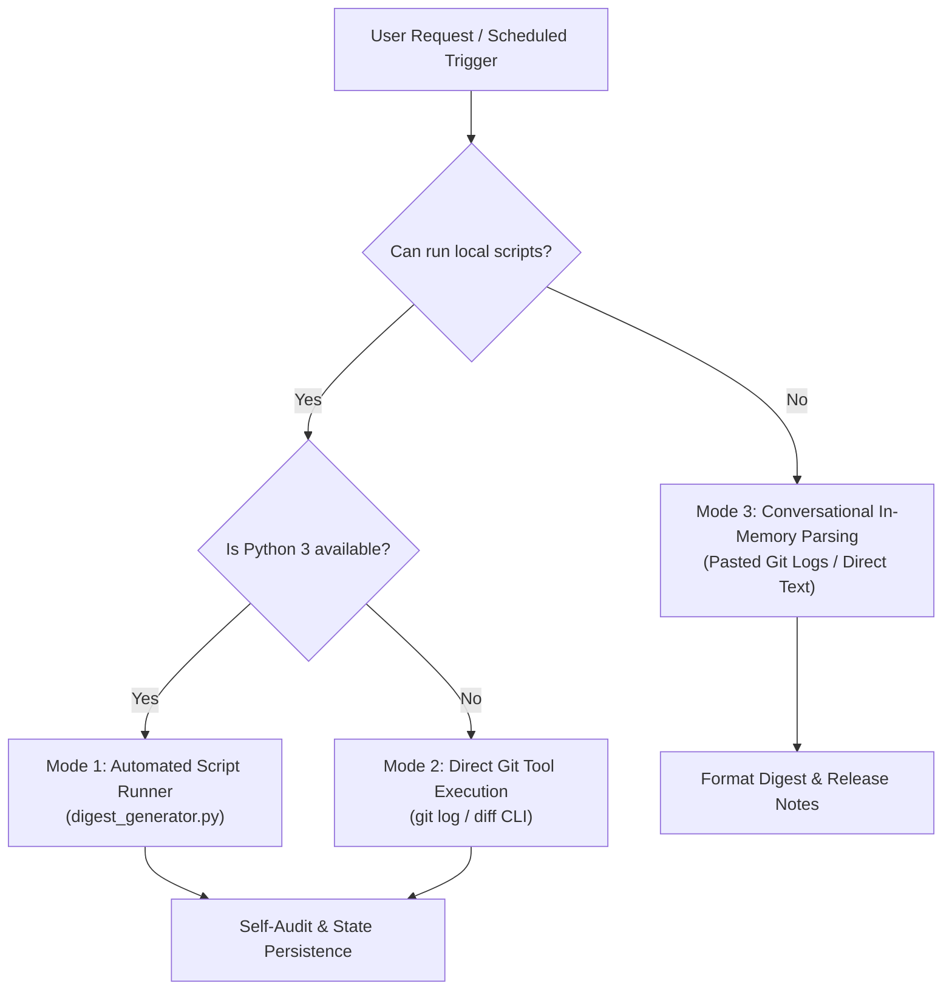

# Daily Project & Git Digest Skill

This skill guides the AI agent through performing deterministic, autonomous daily audits of any Git repository. It extracts changes, groups commits by conventional commit types, identifies contributors, calculates code metrics, generates structured markdown reports, and updates rolling release notes while maintaining incremental state tracking.

---

## 1. Operating Modes & Decision Matrix

The agent should select the appropriate execution path based on available capabilities:



### Mode 1: Automated Script Execution (Preferred when Python & tools are available)
Run the bundled generator script to parse commits, diff statistics, and update state:
```bash
python .agents/skills/daily-git-digest/scripts/digest_generator.py --repo-path "." --output-dir "reports" --update-release-notes
```

### Mode 2: Direct Git Tool Execution (When Git CLI is available but Python is not)
1. **Determine Commit Range**:
   * Inspect `.digest_state.json` if it exists to get `last_commit_hash`.
   * If `last_commit_hash` exists: verify with `git rev-parse --verify <hash>`. If valid and not equal to HEAD, range is `<last_commit_hash>..HEAD`. If equal, stop early: "No new commits since last digest run."
   * If missing or invalid: use `--since="24 hours ago"`.
2. **Extract Commit Log**:
   ```bash
   git log <RANGE> --pretty=format:"%h%x1f%H%x1f%an%x1f%ad%x1f%s" --date=short
   ```
3. **Extract Diff Statistics**:
   ```bash
   git diff --shortstat <RANGE>
   ```
4. **Extract Merges & Pull Requests**:
   ```bash
   git log <RANGE> --merges --pretty=format:"%h %s (%an)"
   ```

### Mode 3: In-Memory Conversational Parsing (When no local tools are available or logs are pasted)
If the user pastes raw `git log` output into the chat, the agent parses the commit records directly in memory, applies the Conventional Commits rules below, formats the digest markdown in the response, and produces release notes entries.

---

## 2. Conventional Commits Categorization Rules

When categorizing commits, match commit subject lines against the following regex patterns (case-insensitive):

| Category | Emoji & Section Title | Match Patterns | Description & Examples |
| :--- | :--- | :--- | :--- |
| **Breaking Changes** | ⚠️ Breaking Changes | `BREAKING CHANGE:`, `^[a-z]+(\([^\)]+\))?!:` | Breaking API or behavior changes. Must be elevated to top banner. |
| **Features** | 🚀 Features & Enhancements | `^feat(\([^\)]+\))?:`, `^feature(\([^\)]+\))?:` | New capabilities, user-facing enhancements, endpoints. |
| **Fixes** | 🐛 Bug Fixes | `^fix(\([^\)]+\))?:`, `^bugfix(\([^\)]+\))?:`, `^hotfix(\([^\)]+\))?:` | Patches, bug resolutions, defect corrections. |
| **Documentation** | 📚 Documentation & Guides | `^docs?(\([^\)]+\))?:` | README, API docs, comments, architectural specs. |
| **Refactoring** | ♻️ Refactoring & Performance | `^refactor(\([^\)]+\))?:`, `^perf(\([^\)]+\))?:`, `^style(\([^\)]+\))?:` | Code restructuring, performance optimizations, formatting. |
| **Tests** | 🧪 Tests & Coverage | `^tests?(\([^\)]+\))?:` | Unit tests, integration tests, end-to-end suites. |
| **Maintenance** | 🔧 Maintenance & Chores | `^chore(\([^\)]+\))?:`, `^build(\([^\)]+\))?:`, `^ci(\([^\)]+\))?:` | Dependencies, build tooling, CI/CD pipelines, workflows. |
| **Merges** | 🔀 Merges & Pull Requests | `^Merge\s+(pull\s+request\|branch)` | PR and branch merges. Extract issue or PR reference (#123). |

*Any commit that does not match these patterns is placed under a general **Other Changes** subsection.*

---

## 3. Daily Digest Markdown Output Structure

Generate reports saved to `reports/daily-digest-YYYY-MM-DD.md` (or printed in the conversation in Mode 3) following this exact layout:

```markdown
# 📅 Daily Project & Git Digest: <REPO_NAME>
**Date:** YYYY-MM-DD | **Branch:** `<BRANCH>` | **Total Commits:** <N>

## 📊 Executive Metrics
| Metric | Count |
| :--- | :--- |
| **Commits Audited** | <N> |
| **Active Contributors** | <N> (<LIST_OF_NAMES>) |
| **Files Changed** | <N> |
| **Lines Added / Removed** | +<INSERTIONS> / -<DELETIONS> |

<!-- If breaking changes exist -->
> [!WARNING]
> **Breaking Changes Detected:**
> - [`<HASH>`] **<SUBJECT>** — *<AUTHOR>*

## 🚀 Features & Enhancements
- [`<HASH>`] **<SUBJECT>** — *<AUTHOR>*

## 🐛 Bug Fixes
- [`<HASH>`] **<SUBJECT>** — *<AUTHOR>*

## 📚 Documentation & Guides
- [`<HASH>`] **<SUBJECT>** — *<AUTHOR>*

## ♻️ Refactoring & Performance
- [`<HASH>`] **<SUBJECT>** — *<AUTHOR>*

## 🔧 Maintenance & Chores
- [`<HASH>`] **<SUBJECT>** — *<AUTHOR>*

---
*(Report automatically generated by `daily-git-digest` skill)*
```

---

## 4. Rolling Release Notes Maintenance (`RELEASE_NOTES.md`)

When updating `RELEASE_NOTES.md`:
1. Check if `RELEASE_NOTES.md` exists in the repository root. If not, initialize with `# Release Notes\n\n`.
2. Filter commits to **only user-facing entries**:
   * Elevate `Features` and `Bug Fixes`.
   * Exclude internal `chores`, `ci`, and trivial typos unless requested.
3. Prepend the daily rollup under the top header:
   ```markdown
   ### [YYYY-MM-DD] Daily Rollup
   #### Features
   - <subject> (<short_hash>)
   
   #### Bug Fixes
   - <subject> (<short_hash>)
   ```

---

## 5. Self-Audit & Quality Maintenance Loop

When concluding an audit (whether via tool or conversationally), execute this quality loop:

1. **Ticket & PR Cross-Referencing**:
   * Scan commit messages for ticket patterns (e.g. `#123`, `JIRA-456`, `GH-789`).
   * When ticket numbers are detected, ensure they are preserved and linked in the generated report.
2. **Gapless Verification**:
   * Verify that every commit between `last_commit_hash` and `HEAD` is accounted for in one of the categories.
   * If any merge conflicts or orphaned commits are detected, flag them in an audit note.
3. **State Persistence**:
   * Update `.digest_state.json` with the current run parameters:
     ```json
     {
       "last_run_timestamp": "ISO_TIMESTAMP",
       "last_commit_hash": "FULL_HEAD_SHA",
       "digests_generated_count": 4
     }
     ```
4. **Idempotency Guard**:
   * If `HEAD` matches `last_commit_hash`, report:
     `Notice: No new commits since last digest run (<short_hash>). Skipping report generation.`

---

## 6. Automation Daemons & Cloud Runners

For persistent unattended execution:
* **Local Daemon (Windows)**:
  `powershell -ExecutionPolicy Bypass -File .agents/skills/daily-git-digest/scripts/schedule_task.ps1 -Action Register -DailyTime "09:00"`
* **Remote CI (GitHub Actions)**:
  Uses `.github/workflows/daily-digest.yml` configured on cron schedule (`0 0 * * *`) with `contents: write` permissions.
