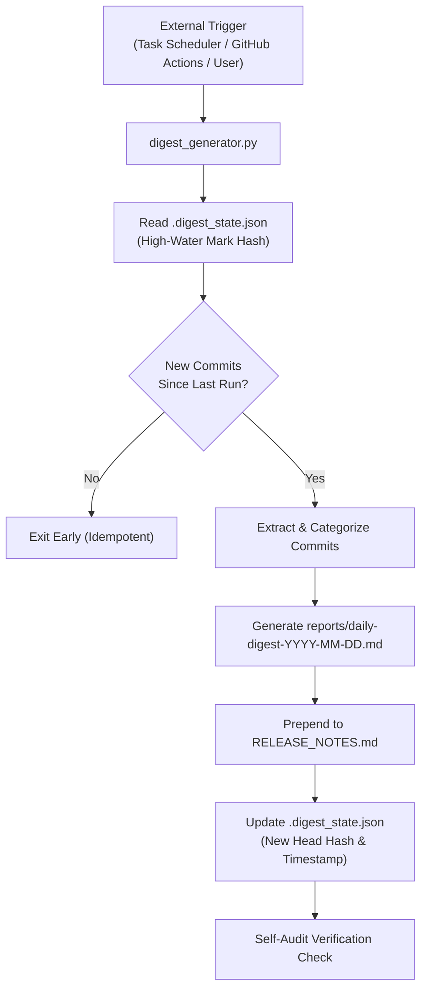

# Daily Git Digest Architecture & Automation Reference

This document explains the architectural patterns for running self-updating, continuous skill workflows within the Antigravity ecosystem.

---

## 1. Operating Model & Constraints

### Trigger on Demand
Antigravity skills do not run as ambient, unprompted background daemons inside the editor. They are activated when:
1. A user prompt matches the skill's frontmatter trigger criteria (e.g., *"generate today's git digest"*).
2. The user or an agent invokes a workflow slash command.
3. An external trigger (Task Scheduler, Cron, or GitHub Actions) invokes a headless CLI or agent session.

### Deterministic Focus
Rather than attempting to do all possible project management tasks, this skill specializes in:
- Extracting exact Git revision history.
- Classifying changes deterministically via regex-backed Conventional Commit rules.
- Writing structured markdown rollups and appending to release notes.

---

## 2. Achieving Daily Self-Updating Behavior

To make this workflow run autonomously every day and stay current, three interlocking mechanisms are implemented:



### A. Trigger-Based Refresh & State Tracking (`.digest_state.json`)
The script stores state in `.digest_state.json`:
```json
{
  "last_run_timestamp": "2026-09-28T09:00:00",
  "last_commit_hash": "a1b2c3d4e5f6...",
  "digests_generated_count": 12
}
```
Whenever triggered, it evaluates:
- If `last_commit_hash` equals `HEAD`, it exits cleanly without producing redundant duplicate reports.
- If new commits are detected, it audits the revision range `last_commit_hash..HEAD`.
- If no state file exists, it defaults to `--days 1` (last 24 hours).

### B. External Automation

#### Option 1: Local Windows Task Scheduler
The companion script `schedule_task.ps1` registers a daily scheduled task in Windows:
```powershell
# Register to run daily at 9:00 AM
powershell -ExecutionPolicy Bypass -File .agents/skills/daily-git-digest/scripts/schedule_task.ps1 -Action Register -DailyTime "09:00"

# Check status
powershell -ExecutionPolicy Bypass -File .agents/skills/daily-git-digest/scripts/schedule_task.ps1 -Action Status
```

#### Option 2: Remote CI/CD via GitHub Actions (`daily-digest.yml`)
Runs every midnight UTC on GitHub runners. Automatically commits new daily reports and release notes back to the repository.

### C. Self-Audit Evaluation Loop
Before concluding, the skill runs verification checks:
1. **Markdown Structural Integrity**: Verifies that headers, metrics table, and lists are formatted properly without orphan tokens.
2. **Release Notes Deduplication**: Ensures duplicate entries for the same date are not stacked repeatedly.
3. **Commit Hash Traceability**: Ensures all hashes referenced in reports actually resolve to valid commits in the Git object database.
